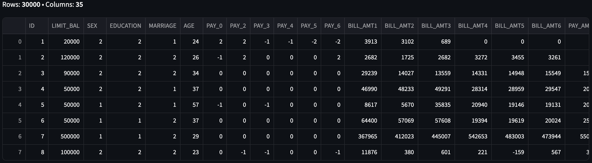
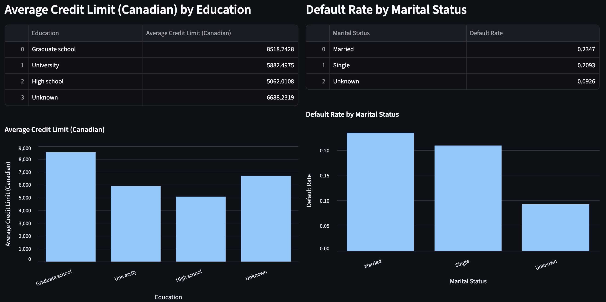

# Credit Risk Scoring with Pandas, SQL, and Machine Learning  

## Overview  
This project uses the **UCI credit card dataset**, which contains **30,000 customer records**. The dataset includes demographic details (age, sex, education, marital status), financial information (credit limits, bill amounts, repayment history), and whether the customer defaulted on their next payment. 

The purpose of this project was to:  
- Demonstrate **parsing and cleaning large datasets** with pandas and SQL.  
- Use **data visualization** to find trends, such as who is more likely to default, who has higher credit limits, and who spends the most.  
- Apply **machine learning** (Random Forest and Logistic Regression) to predict which customers are likely to default and why.  

---

## Sample Data  
Here’s a preview of the dataset:  

  

---

## Data Analysis with Pandas & SQL  
The first stage focused on **cleaning and exploring** the dataset:  
- Converted numeric codes (e.g., Education = 1,2,3) into **human-readable labels** (Graduate School, University, etc.).  
- Converted amounts from TWD to **Canadian dollars** for easier interpretation.  
- Used **pandas** and **SQL queries** to group and summarize trends.  

### Key Explorations  
- **Average Credit Limit (Canadian)** by education and marital status.  
- **Default Rate** across different groups (education, marital status, sex, age).  
- **Utilization Ratio** (bill ÷ credit limit) distribution.  
- **Top Spenders** by latest bill and by utilization ratio.  

  

From the analysis, clients with a **Graduate School** education have the highest average credit limits in Canadian dollars, followed by those with a University degree.
This could be because individuals with higher education levels often secure higher-paying jobs, leading banks to trust them with larger credit lines.

The data shows that **Married** clients are slightly more likely to default compared to Single or Unknown groups.
One possible reason could be that married households often have higher combined expenses (mortgages, dependents, etc.), which may increase financial stress and default risk.

## Machine Learning 

After analyzing the data, I trained a LLM model to **predict whether a customer would default** on their credit card.  

- The model learned from **30,000 past customer records**, which included features like Credit limit, Education level, Marital status, Age, How much of their limit they used, and Past repayment history.

- The job of the model was to **guess “Default” or “No Default” for each customer**.  

- I used a method called **Random Forest**:  
  - Imagine asking **100 small decision trees** to each make a guess.  
  - Each tree sees slightly different parts of the data.  
  - They all “vote” and the forest gives the final answer.  
  - This makes the prediction **more accurate and reliable** than a single tree.  

- The model gives two outputs:  
  1. A **probability of default** (for example, 0.72 = 72% chance).  
  2. A **final decision** (Default / No Default) based on a threshold.  

- We also checked **feature importance** to see what mattered most.  
  - Features like **repayment history** and **credit utilization** were the biggest drivers of default risk.  

In plain terms: The machine learning part was about teaching the computer to recognize patterns in the data, so it can predict which new customers are **at higher risk of defaulting**.  

---
