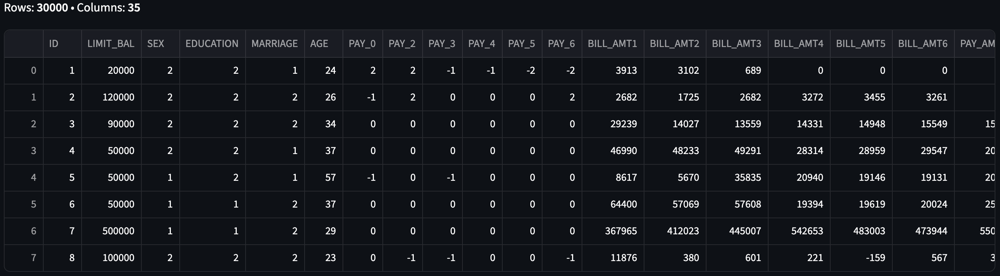
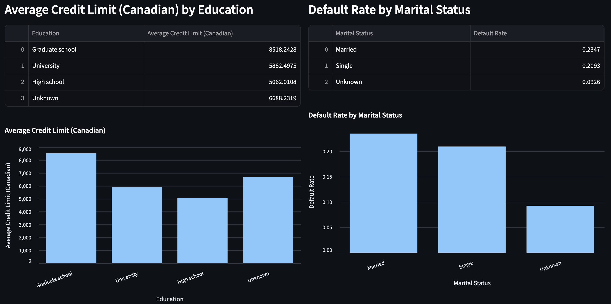
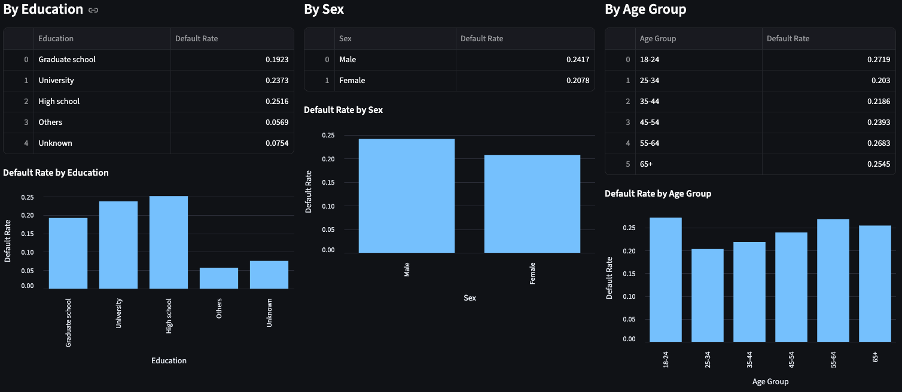
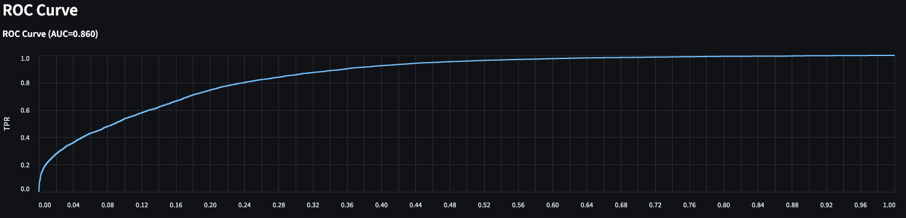

# Credit Risk Scoring with Pandas, SQL, and Machine Learning  

## Overview  
This project uses the **UCI credit card dataset**, which contains **30,000 customer records**. The dataset includes demographic details (age, sex, education, marital status), financial information (credit limits, bill amounts, repayment history), and whether the customer defaulted on their next payment. 

The purpose of this project was to:  
- Demonstrate **parsing and cleaning large datasets** with pandas and SQL.  
- Use **data visualization** to find trends, such as who is more likely to default, who has higher credit limits, and who spends the most.  
- Apply **machine learning** to predict which customers are likely to default and why.  

---

## Sample Data  
Here’s a preview of the dataset:  

  

---

## Data Analysis with Pandas & SQL  
The first stage focused on **cleaning and exploring** the dataset:  
- Converted numeric codes (e.g., Education = 1,2,3) into **human-readable labels** (Graduate School, University, etc.).  
- Converted amounts from TWD to **Canadian dollars** for easier interpretation.  
- Used **pandas** and **SQL queries** to group and summarize trends.  

### Key Explorations  
- **Average Credit Limit (Canadian)** by education and marital status.  
- **Default Rate** across different groups (education, marital status, sex, age).  
- **Utilization Ratio** (bill ÷ credit limit) distribution.  
- **Top Spenders** by latest bill and by utilization ratio.  

  

From the analysis, clients with a **Graduate School** education have the highest average credit limits in Canadian dollars, followed by those with a University degree.
This could be because individuals with higher education levels often secure higher-paying jobs, leading banks to trust them with larger credit lines.

The data shows that **Married** clients are slightly more likely to default compared to Single or Unknown groups.
One possible reason could be that married households often have higher combined expenses (mortgages, dependents, etc.), which may increase financial stress and default risk.

## Machine Learning  

After analyzing the data, I trained a model to **predict whether a customer would default** on their credit card.  

The model learned from **30,000 customer records** containing details like credit limit, education, marital status, age, utilization ratio, and repayment history. Its goal was to **classify each customer as “Default” or “No Default.”**

I used a method called **Random Forest**, which is a collection of many small decision trees that each make a prediction. Every tree looks at different parts of the data, and then they all **vote** on the final answer. This makes the overall prediction **more accurate and stable** than using just one tree.

Here’s a simple illustration of how **Random Forest** works:
<pre>
                ┌──────────────────────────┐
                │        Credit Limit      │
                └─────────────┬────────────┘
                              │
               ┌──────────────┴──────────────┐
         Credit Limit ≥ $10,000        Credit Limit < $10,000
               │                                 │
     ┌─────────┴─────────┐               ┌───────┴─────────┐
  Repayment History     Repayment    Education Level     Education Level
       (Good)           History (Bad)   (Graduate)         (High School)
       │                     │              │                    │
 "No Default"         "Default Likely"   "No Default"       "Default Likely"

</pre>

In simple terms, this model teaches the computer to **recognize patterns** in past customer data and predict which new customers might be **at higher risk of defaulting**.

As shown below, I found that:
- **High School** graduates are the most likely to default by education level.  
- By **sex**, **males** are more likely to default than females.  
- By **age group**, individuals aged **18–24** have the highest default rate,  
  which drops through middle age and then rises again for ages **55–64**,  
  where the default rate is also significantly higher.

The **ROC curve** below shows how well the model separates defaulters from non-defaulters:  
- The **curve** measures how well the model balances accuracy across different thresholds.  

The **AUC (Area Under the Curve)** is **0.86**, meaning the model is **86% accurate** at ranking risky customers higher than safe ones. This indicates strong predictive performance — the Random Forest model reliably distinguishes between likely defaulters and non-defaulters.  

---

### Final Thoughts  

This project really interested me because I feel like people are going into debt every day. A machine learning system like this could be implemented by banks to help **safeguard people before they go into debt**. Models like this could even be used to create **adaptive credit limits** that adjust automatically, protecting customers from defaulting on their cards.  

I learned a lot from this project as it strengthened my skills in **SQL**, **Pandas**, and grew my knowledge of **machine learning**, while showing me how datasets can be manipulated to generate meaningful **reports and insights**.